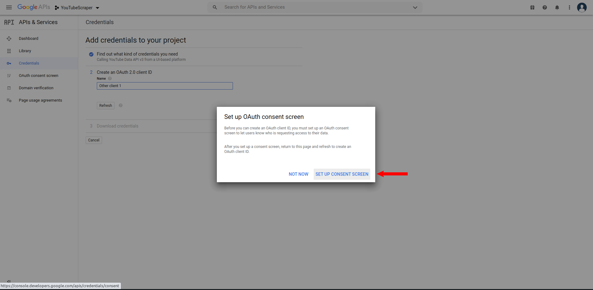
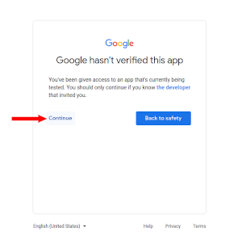
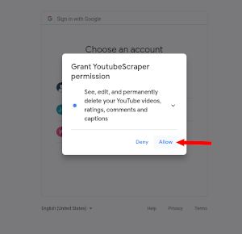

layout: true

```{r setup, include = F}
if (!require(easypackages)) install.packages("easypackages")
library(easypackages)

packages("knitr", "rmarkdown", "tidyverse", "kableExtra", "hadley/emo", "tuber", prompt = F)

options(htmltools.dir.version = FALSE, stringsAsFactors = F)

opts_chunk$set(echo = TRUE, fig.align = "center")

xaringanExtra::use_xaringan_extra(c("tile_view", "clipboard"))
xaringanExtra::use_extra_styles(hover_code_line = TRUE,
                                mute_unhighlighted_code = FALSE)

```

<div class="my-footer">
  <div style="float: left;"><span>`r gsub("<br />", ", ", gsub("<br /><br />|<a.+$", "", metadata$author))`</span></div>
  <div style="float: right;"><span>`r metadata$location`, `r metadata$date`</span></div>
  <div style="text-align: center;"><span>`r gsub(".+<br />", " ", metadata$subtitle)`</span></div>
</div>

---


# Setting up API access to the *YouTube* API
 
To effectively work with *YouTube* data, we need access to its Application Programming Interface (API). As this process, unfortunately, can be a bit tedious, we prepared this preliminary tutorial so you don't have to spend time setting up your API access during the workshop. Please follow this tutorial and check if the setup works before the workshop. If your setup does not work, feel free to contact us before the workshop (the sooner the better) and we'll try to assist you in setting up access to the *YouTube* API. If, for some reason, setting up access to the API does not work for you and we don't find a solution or if you cannot access the API during the workshop, we will have some data prepared that you can then work with in the workshop.

Contact: julian-kohne@gesis.org
  
[HINT](https://en.wikipedia.org/wiki/YouTube): Pink texts in the slides are hyperlinks that you can simply click on

---
# Setting up API Access
  
- For starters, you need a *Gmail* account
- We suggest that you create a new account specifically for this workshop, so you don't mess up or accidentally share the credentials of your private or work account 

- You can create a new account [here](https://accounts.google.com/signup/v2/webcreateaccount?service=mail&continue=https%3A%2F%2Fmail.google.com%2Fmail%2F&ltmpl=googlemail&gmb=exp&biz=false&flowName=GlifWebSignIn&flowEntry=SignUp)

- Next, you need to:
  - Sign up for the *Google developer console*
  - Create a new project
  - Activate the *YouTube Data API*
  - Create authentication credentials
  - Test the credentials from R

We will explain these steps in detail on the following slides.

---
# Google Developer Console
  
- Go to the [Developer Console](https://console.developers.google.com) and log in with your (new) *Google* Account


---
# Accepting the Terms of Service

- You need to accept the Google Developer ToS, deselect the email updates and click "Agree and continue"


---
# Creating a Project

- On the top right of the screen, click on "create project" to start a new project


---
# Creating a Project

- Enter a project name and click on "create", you don't need to specify an organization


---
# Enabling YouTube Data API v3

- On the next screen, click on "Enable APIs and services" in the top left


---
# Enabling YouTube Data API v3

- Enter "YouTube" in the search bar and select "YouTube Data API v3" by clicking on it


---
# Enabling YouTube Data API v3

- Next, click on the blue "Enable" button on the left side 


---
# Setting up Credentials

- Click on the "Create credentials" button on the top right of your screen


---
# Setting up Credentials

- Select "YouTube Data API v2", "Other UI" and "User data" in the respective field
and click on "What credentials do I need?" on the bottom of the screen


---
# Configuring Consent Screen

- A popup will prompt you to set up as consent screen before proceeding, click on "Set up consent screen"



---
# Configuring Consent Screen

- Select "External" and click on "create"


---
# Configure Scopes

- On the next screen, enter an arbitrary app name and enter your gmail address twice as "User support Email" and "Developer Contact Information". you can leave the other fields blank.


---
# Configure scopes

- Next, click on "Add or remove scopes" to open a side panel on the right side. In this panel, select all
fields for the YouTube Data API v3 and click on "update" on the bottom right. Be sure to check all items on all
pages.


---
# Configure scopes

- Click on "safe and continue" and the bottom left of the page


---
# Add yourself as a user

- On the subsequent page, click on "Add users", enter your gmail address and confirm by clicking "add".


---
# Add yourself as a user

- On the bottom left of the next page, click on "Back to dashboard"


---
# Setting up Credentials (2)

- On the dashboard page, click on "Credentials" in the menu on the top left


---
# Setting up Credentials (2)

- On the top, click on "Create Credentials" and select "OAuth Client ID" from the dropdown menu


---
# Setting up Credentials (2)

- Select "Desktop App" as your application type and enter an arbitrary name for the set of credentials, then click on the blue "create" button


---
# Setting up Credentials (2)

- Congratulations! You now have your own Client ID and secret. Do not share these with anybody else, as they give
full user rights for your new Youtube account to anybody who has them. You can copy and paste them into R before closing the
window by clicking on "OK". You can access them again anytime by clicking on the name you set for these credentials.


---
# Testing Access

- You can safely try whether your *YouTube API access* works as intended by running the 
  following commands in `R`:

```{r eval = FALSE}
# installing the tuber package if not installed already
if("tuber" %in% installed.packages() != TRUE) {
  install.packages("tuber")
}

# loading tuber package
library(tuber)

# Your Credentials (NEVER SHARE THIS INFORMATION)
ID <- "ENTER-YOUR-CLIENT-ID"
secret <- "ENTER-YOUR-CLIENT-SECRET"

# authentication
yt_oauth(ID,secret)

# You will be asked in the R-console to
# save an access token: Select no by entering 2
# You will be send to your browser to log in

```
---
# Grant yourself access

- In the webbrowser window that was opened from your R session, select your new gmail account


---
# Grant yourself access

- Google warns you that the app has not been verified, you can trust yourself and click on "continue"


---
# Grant yourself access

- Allow the app (and hence yourself) to make changes to the account you created


---
# Grant yourself access

- confirm your choices once more by clicking on "Allow"


---
# Grant yourself access

- Your browser should now display the following message. You can close his window now and return to R


---
# Test API call

- To easily check if everything worked, let's try to collect some simple data about a video.

```{r eval = FALSE}

# get statistics of https://www.youtube.com/watch?v=HluANRwPyNo
get_stats(video_id="HluANRwPyNo")

```

---
# Output

- If everything worked correctly, your output structure should look something like this.
  The actual numbers will vary because they might change in the meantime.

```{r eval = FALSE}
$id
[1] "HluANRwPyNo"

$viewCount
[1] "10244939"

$likeCount
[1] "509791"

$dislikeCount
[1] "4799"

$favoriteCount
[1] "0"

$commentCount
[1] "20581"
```
---
# A Few Words of Advice on Handling Your *YouTube API Access*

- Have one account and project ready for the workshop for which you know that it works
- Do not use your API access too excessively before the workshop to avoid any risk of it being suspended
  
- Never share your OAuth login credentials! This can easily happen by accident when
  - saving code in a GitHub Repo
  - sending scripts to colleagues
  - troubleshooting someone elses code
  - for added security you can use the [`keyring` package](https://cran.r-project.org/web/packages/keyring/keyring.pdf) (we'll say a bit more about this in the workshop)
 
---
class: center, middle

# We hope that you are now all set up and look forward to seeing you online!
