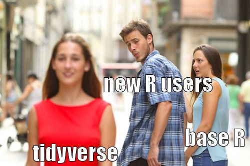
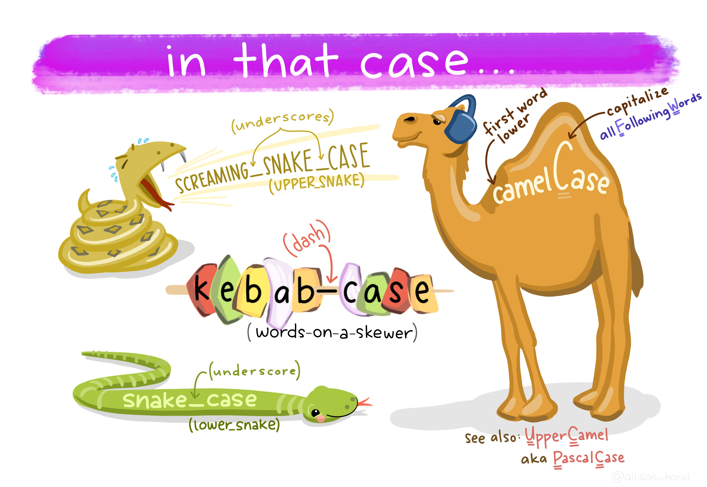

layout: true

```{r setup, include = F}
if (!require(easypackages)) install.packages("easypackages")
library(easypackages)

packages("knitr",
         "rmarkdown",
         "gadenbuie/xaringanExtra",
         "gadenbuie/tweetrmd",
         "hadley/emo",
         prompt = F)

options(htmltools.dir.version = FALSE)

opts_chunk$set(echo = FALSE,
               fig.align = "center")

xaringanExtra::use_xaringan_extra(c("tile_view", "clipboard"))
xaringanExtra::use_extra_styles(hover_code_line = TRUE,
                                mute_unhighlighted_code = FALSE)
```

<div class="my-footer">
  <div style="float: left;"><span>`r gsub("<br />", ", ", gsub("<br /><br />|<a.+$", "", metadata$author))`</span></div>
  <div style="float: right;"><span>`r metadata$location`, `r metadata$date`</span></div>
  <div style="text-align: center;"><span>`r gsub(".+<br />", " ", metadata$subtitle)`</span></div>
</div>

---

# Goals of this course

In this course you will learn...
  - how to use *YouTube* data for research
  - which tools exist for collecting *YouTube* data, their advantages and disadvantages

After this course you should be able to...
  - automatically collect *YouTube* data
  - process/clean it
  - do some basic (exploratory) analyses of user comments

---

# About us


### Julian Kohne

- M.Sc. in Social Psychology, University of Groningen (NL)

- Scientific Advisor in GESIS presidentidal staff / CSS department
  - Main area: developments of GESIS in the area of digital behavioral data

- PhD Student at University of Ulm / Stanford Social Media Lab
  - Field: Social Psychology
  - Topic: Quantifying interpersonal relationships with chat log data (WhatsApp)

[julian.kohne@gesis.org](mailto:julian.kohne@gesis.org)

---

# About us


### Johannes Breuer

- Senior researcher in the team Data Linking & Data Security at the GESIS Data Archive
    - digital trace data for social science research
    - data linking (surveys + digital trace data) 
    
- Ph.D. in Psychology, University of Cologne  

- Previously worked in several research projects investigating the use and effects of digital media (Cologne, Hohenheim, Münster, Tübingen)  

- Other research interests
    - Computational methods
    - Data management
    - Open science

[johannes.breuer@gesis.org](mailto:johannes.breuer@gesis.org), [@MattEagle09](https://twitter.com/MattEagle09)

---

# About us


### M. Rohangis Mohseni 

- Postdoctoral researcher (Media Psychology) at TU Ilmenau

- Ph.D. in Psychology, University Osnabrueck

- Ongoing habilitation "sexist online hate speech" `r ji("imp")`

- Other research interests
  - Electronic media effects
  - Moral behavior

[rohangis.mohseni@tu-ilmenau.de](mailto:rohangis.mohseni@tu-ilmenau.de), [@romohseni](https://twitter.com/romohseni)

---

# About you

- What's your name?  

- Where do you work?  

- What is your experience with `R`?

- Why/how do you want to use *YouTube* for your research?


---

# Prerequisites for this course

- Working version of `R` and [RStudio](https://rstudio.com/products/rstudio/download/#download)

- Some basic knowledge of `R`  

- Interest in working with *YouTube* data

---

# Preliminaries

- Feel free to ask questions at any time  

- We want to make this workshop as interactive as possible  

- Slides and other materials are available at

[https://github.com/jobreu/youtube-workshop-gesis-2021](https://github.com/jobreu/youtube-workshop-gesis-2021)

---

# Base `R` vs. `tidyverse`

In this course, we will use a mixture of base `R` and `tidyverse` code as Julian prefers base `R`, Johannes prefers the `tidyverse`, and Ro is agnostic.

ICYC, here are some opinions [for](http://varianceexplained.org/r/teach-tidyverse/) and [against](https://blog.ephorie.de/why-i-dont-use-the-tidyverse) using/teaching the `tidyverse`.

Johannes' experience with learning and teaching the `tidyverse` is something like this...
```{r tidyverse meme, out.width = "60%"}

```

---

# The `tidyverse`

If you've never seen `tidyverse` code, the most important thing to know is the `%>%` [(pipe) operator](https://magrittr.tidyverse.org/reference/pipe.html). Put briefly, the pipe operator takes an object (which can be the result of a previous function) and pipes it as the first argument into the next function. It may also be worthwhile to know/remember that `tidyverse` functions normally produce (and expect) [`tibbles`](https://tibble.tidyverse.org/) which are a special type of dataframe.

If you want a short primer (or need a quick refresher) on the `tidyverse`, you can check out this blog [post by Martin Frigaard](http://www.storybench.org/getting-started-with-tidyverse-in-r/) or this [short webinar by Thomas Mock](https://resources.rstudio.com/webinars/a-gentle-introduction-to-tidy-statistics-in-r). For a more in-depth exploration you can, e.g., have a look at the materials for the workshop [*Data Wrangling & Exploration with the Tidyverse in R*](https://github.com/jobreu/tidyverse-workshop-gesis-2019) that Johannes taught together with Stefan Juenger at GESIS last year.

---

# What's in a name?

Another thing you might notice when looking at our code is that we love `r ji("snake")` as much as `r ji("camel")`.

```{r cases, out.width = "75%"}

```
.center[
<small><small>Illustration by [Allison Horst](https://github.com/allisonhorst/stats-illustrations)</small></small>
]
---
# Course schedule

.center[**Wednesday, February 24th, 2021**]
```{r schedule Wed, echo = F}
schedule <- data.frame(
  "When?" = c("10:00 - 11:00", "11:00 - 11:30", "11:30 - 12:30", "12:30 - 13:30", "13:30 - 14:30", "14:30 - 15:30", "15:30 - 16:00", "16:00 - 17:30", "18:00 - 20:00")
  , "What?" = c("Introduction: Why is YouTube data interesting for research?", "<i>Coffee break</i>", "The YouTube API", "<i>Lunch break</i>", "Tools for the automatic sampling of YouTube data", "Collecting data with the tuber package for R","<i>Coffee break</i>", "Processing and cleaning user comments (in R)", "<i>Get Together</i>")
  , stringsAsFactors = FALSE
  , check.names = FALSE
)
knitr::kable(
  schedule
  , format = "html"
  , align = "cc"
  , escape = FALSE
)
```

---

# Course schedule

.center[**Thursday, February 25th, 2021**]
```{r schedule Thur, echo = F}
sharing_options <- data.frame(
  "When?" = c("09:00 - 10:30", "10:30 - 11:00", "11:00 - 12:00", "12:00 - 13:00", "13:00 - 14:00", "14:00 - 14:30", "14:30 - 16:00")
  , "What?" = c("Basic text analysis of user comments", "<i>Coffee break</i>", "Sentiment analysis of user comments", "<i>Lunch break</i>", "Excursus: Retrieving video subtitles", "<i>Coffee break</i>", "Practice session, questions, and outlook")
  , stringsAsFactors = FALSE
  , check.names = FALSE
)
knitr::kable(
  sharing_options
  , format = "html"
  , align = "cc"
  , escape = FALSE
)
```

---

# Why is *YouTube* relevant?
- Largest / most important online video platform<br /><small>([Alexa Traffic Ranks, 2019](https://www.alexa.com/topsites); [Konijn, Veldhuis, & Plaisier, 2013](https://doi.org/10.1089/cyber.2012.0357))</small>

- Esp. popular among adolescents who use it to watch movies & shows, listen to music, and retrieve information<br /><small>([Feierabend, Plankenhorn, & Rathgeb, 2016](https://www.mpfs.de/studien/kim-studie/2016/))</small>

- For adolescents, *YouTube* partly replaces TV<br /><small>([Defy Media, 2017](http://www.newsroom-publicismedia.fr/wp-content/uploads/2017/06/Defi-media-acumen-Youth_Video_Diet-mai-2017.pdf))</small>

---

# Why is *YouTube* data interesting for research?

- Content producers and users generate huge amounts of data

- Useful for research on media content, communicators, and user interaction

- Data publicly available 

- Relatively easy to retrieve via *YouTube* API

---

# Research Examples

- What do people write (content)?
  - Sexist Online Hate Speech<br /><small>([Doering & Mohseni, 2019a](https://doi.org/10.1080/14680777.2018.1467945), [2019b](https://doi.org/10.1080/08824096.2019.1634533),[2020](https://doi.org/10.5771/2192-4007-2020-1-62); [Thelwall & Mas-Bleda, 2018](https://doi.org/10.1108/AJIM-09-2017-0204); [Wotanis & McMillan, 2014](https://doi.org/10.1080/14680777.2014.882373))</small>

  - Comment characteristics<br /><small>([Thelwall, Sud, & Vis, 2012]( https://doi.org/10.1002/asi.21679))</small>

  - Subtopics, sentiments, & gender differences<br /><small>([Thelwall, 2017](https://doi.org/10.1080/13645579.2017.1381821); [Röchert, Neubaum, Ross, Brachten, & Stieglitz, 2020](https://computationalcommunication.org/ccr/article/view/15/7))</small>

---

# Research Examples

- Who writes it (communicator)?
    - User experiences<br /><small>([Defy Media, 2017](http://www.newsroom-publicismedia.fr/wp-content/uploads/2017/06/Defi-media-acumen-Youth_Video_Diet-mai-2017.pdf); [Lange, 2007](http://citeseerx.ist.psu.edu/viewdoc/download?doi=10.1.1.170.3808&rep=rep1&type=pdf); [Moor, Heuvelman, & Verleur, 2010](https://doi.org/10.1016/j.chb.2010.05.023); [Oksanen, Hawdon, Holkeri, Naesi, & Raesaenen, 2014](https://doi.org/10.1108/S1537-466120140000018021); [Szostak, 2013](https://journals.mcmaster.ca/mjc/article/view/280); [Yang, Hsu, & Tan, 2010](https://doi.org/10.1089/cyber.2009.0105))</small>
    
    - Radicalization<br /><small>([Ribeiro et al., 2020](https://doi.org/10.1145/3351095.3372879))</small>
    
    - Filter bubble/Structural hierarchy<br /><small>([Kaiser & Rauchfleisch, 2020](https://doi.org/10.1177/2056305120969914); [Rieder et al., 2020](https://doi.org/10.5210/fm.v25i8.10667))

---

# Tools for the Automatic Sampling of YouTube Data

- [Webometric Analyst](http://lexiurl.wlv.ac.uk/)

- [YouTube Data Tools](https://tools.digitalmethods.net/netvizz/youtube/)

- [tuber](https://cran.r-project.org/web/packages/tuber/)

In this course, we will work with the `tuber` package for `R`.

---

# Overview

```{r tools table 1, echo = F}
tools <- data.frame(
  "Method" = c("Type", "Platforms", "Collected Features", "Scoping"),
  "Manual Coding" = c("n/a", "All", "Depends on coding scheme", "Depends on coding scheme"),
  "Webometric Analyst" = c("Program", "Win", "Channel Info, Video Info, Comments, Video Search", "100 most recent or all comments"),
  "YouTube Data Tools" = c("Web service", "All", "Channel Info, Video Info, Comments, Video List", "All comments"),
  "tuber" = c("Package for R", "Win, Mac, Linux, Unix", "Channel Info, Video Info, Comments, Subtitles, All searches", "20-100 most recent or all comments")
  , stringsAsFactors = FALSE
  , check.names = FALSE
)
knitr::kable(
  tools
  , format = "html"
  , align = "cc"
  , escape = FALSE
)
```

---

# Pros and Cons

```{r tools table 2, echo = F}
tools_pc <- data.frame(
  "Method" = c("Need API Key?", "Disadvantages", "Ease of Use", "License", "Example: Dayum Video (22-02-2019, 2pm)"),
  "Manual Coding" = c("No", "Time-consuming", "High", "n/a", "47,163"),
  "Webometric Analyst" = c("Yes", "Only first 5 follow-up comments, no error feedback, undetectable time-outs", "Low", "Free for n/c", "44,828"),
  "YouTube Data Tools" = c("No", "Lacking flexibility, fewer infos", "High", "Open Source", "47,153"),
  "tuber" = c("Yes", "Only first 5 follow-up comments due to bug", "Low", "Open Source", "44,810")
  , stringsAsFactors = FALSE
  , check.names = FALSE
)
knitr::kable(
  tools_pc
  , format = "html"
  , align = "cc"
  , escape = FALSE
)
```

[Dayum Video](https://www.youtube.com/watch?v=DcJFdCmN98s) / [tuber bug](https://github.com/soodoku/tuber/issues/52)

---

class: center, middle

# Any questions so far?