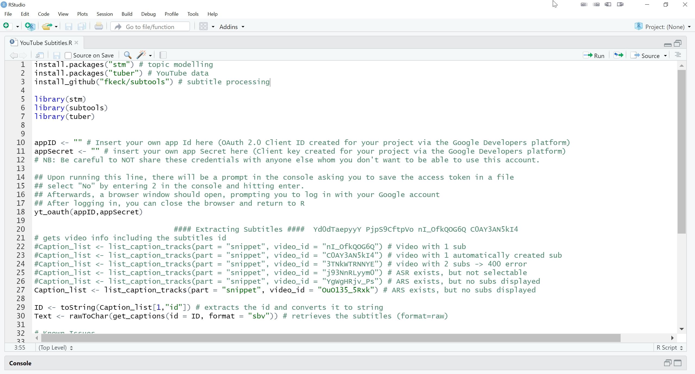

--- 
title: "Automatic Sampling and Analysis of YouTube Data"
subtitle: "Excursus: Retrieving Video Subtitles"
author: "Julian Kohne<br />Johannes Breuer<br />M. Rohangis Mohseni"
date: "2021-02-25"
location: "GESIS, Cologne, Germany" 
output:
  xaringan::moon_reader:
    lib_dir: libs
    css: ["default", "default-fonts", "../workshop.css"]
    nature:
      highlightStyle: "github"
      highlightLines: true
      countIncrementalSlides: false

---

layout: true

```{r setup, include = F}
if (!require(easypackages)) install.packages("easypackages")
library(easypackages)
library(tuber)

packages("knitr", "rmarkdown", "tidyverse", "kableExtra", "hadley/emo", "fkeck/subtools", "tuber", prompt = F)

options(htmltools.dir.version = FALSE)

opts_chunk$set(echo = FALSE, fig.align = "center")

```

<div class="my-footer">
  <div style="float: left;"><span>`r gsub("<br />", ", ", gsub("<br /><br />|<a.+$", "", metadata$author))`</span></div>
  <div style="float: right;"><span>`r metadata$location`, `r metadata$date`</span></div>
  <div style="text-align: center;"><span>`r gsub(".+<br />", " ", metadata$subtitle)`</span></div>
</div>

<style type="text/css">

pre {
  font-size: 10px
}
</style>

---


# Retrieving Video Subtitles with `tuber`

- Instead of transscribing a video, you can retrieve its subtitles.

- What research would you conduct with video subtitles?

---

# Retrieving Video Subtitles with `tuber`

- Retrieve a list of subtitles with

  - `tuber::list_caption_tracks`
  
- Costs around 50 quota

---

# Types of YouTube Subtitles

- Videos with automatically created subtitle (<i>ASR</i>)

  - Always in English, even if video language is non-English

  - Can be downloaded, but text quality can be bad (especially if translated)

- Videos without any subtitles

  - Not sure if even possible because there always seems to be an <i>ASR</i>
  
- Videos with more than one set of subtitles

  - Examples: <i>ASR</i> and regular subtitle, more than one language, more than one subtitle for the same language

  - Can be downloaded, but subtitle for analysis must be selected

- Videos with [deactivated 3rd party contribution](https://stackoverflow.com/questions/30653865/downloading-captions-always-returns-a-403) 

  - Return Error 403; nothing can be downloaded
  
---

# Retrieving Video Subtitles with `tuber`

- First, we need to get the list of subtitles for a video

  `caption_list <- list_caption_tracks(part = "snippet", video_id = "nI_OfkQOG6Q")`

- Next, we need to get the ID of the subtitle and convert it to a string

  `ID <- toString(caption_list[1,"id"])`
  
- Adapt the number to select the subtitle that you want (ASR = automatic sub)

- After that, we need to retrieve the subtitles and convert them from raw to char

  `text <- rawToChar(get_captions(id = ID, format = "sbv"))`

- Now we can save the subtitles to a subtitle file

  `write(Text, file = "Captions.sbv", sep="\n")`

---

# Converting Subtitles

- Subtitles come in a special format called SBV

- The format contains time stamps etc. that we do not need for text analysis

- We can read the format with the package `subtools`

 `subs <- read_subtitles("Captions.sbv", format = "subviewer")`
 
- With subtools, we can also retrieve the text from the subtitles

  `subtext <- get_raw_text(Subs)`

- Now the text is ready for text analysis

---

# Retrieving Video Subtitles with `youtubecaption`

- Alternatively, you can retrieve captions with the package youtubecaption.

- Pros:

  - No credentials necessary, therefore no quota reduction
  
  - Subtitles come as matrix of text and timestamps, so no conversion is needed
  
- Cons:

  - If there is more than one subtitle version per language, there is no way to select a specific one
  
  - You need to install the Python package "Anaconda"

---

# Time for a Live Demonstration

```{r cases, out.width = "75%"}

```

---

class: center, middle

# Any questions?