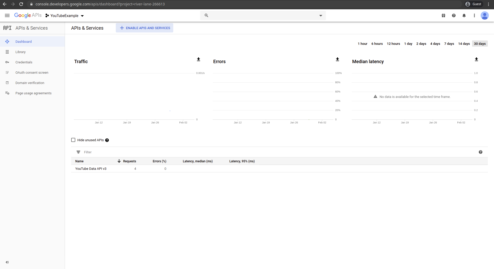

```{r knitr_init, echo=FALSE, cache=FALSE, include=FALSE}
# custom boxes
knitr::opts_template$set(clues = list(box.title = "Clues",
                                      box.body = list(fill = "#fff9dc", colour = "black"),
                                      box.header = list(fill = "#ffec8b", colour = "black"),
                                      box.icon = "fa-search",
                                      box.collapse = TRUE))

```

```{r klippy, echo=FALSE, include=TRUE}
klippy::klippy()
```


```{block, box.title = "Exercise 1", box.body = list(fill = "white"), box.icon = "fa-star"}
If you have not done so before, set up your _YouTube_ API Access in the _Google Developer Console_ and make sure that it's working. If you already did this before, you can skip this step. If not, you should do it now because we will need API access for the next sections.
```

```{block, opts.label = "clues"}
Follow the tutorial that we sent to you by email before the course. If you get stuck in the tutorial, feel free to ask us for help.
```

```{block, box.title = "Exercise 2", box.body = list(fill = "white"), box.icon = "fa-star"}
Go to the _YouTube_ API console and check the amount of requests you already made for the app you are using
```

```{block, opts.label = "clues"}
You can do this by going to the [Developer Console](www.console.developers.google.com) and logging in with the _Google_ account you used for creating the app for your API access. On the top right, next to the "GoogleAPIs" logo, you can make sure that you have selected the right project. If you click on the "Dashboard" panel, you can see the traffic your app has generated. If you click on the name of the app, you get a more detailed panel with Quotas and Metrics.
```
```{block, solution = TRUE}


```

```{block, box.title = "Exercise 3", box.body = list(fill = "white"), box.icon = "fa-star"}
Go to the _YouTube_ quota calulator and calculate the resources needed for the following scenarios:

- _search_ videos with the _list_ method

- get statistics for _videos_ with the _list_ method

- get statistics for _playlistItems_ with the _list_ method

```

```{block, opts.label = "clues"}
You can find the quota calculator [here](https://developers.google.com/youtube/v3/determine_quota_cost) and need to look for the right resource and method. The quota cost of **one** such call is displayed on the right side.
```
```{block, solution = TRUE}

- 100 units _per page_ of results

- 1 unit _per page_ of results

- 1 unit _per page_ of results

```